# DAT : Configuration de Lab

## 1. Téléchargement et Vérification des ISOs

### 1.1 Téléchargement des ISOs
- Télécharger Windows Server (ex : 2022) depuis le site officiel Microsoft : https://www.microsoft.com/fr-fr/evalcenter/
- Télécharger Windows 10/11 depuis Microsoft : https://www.microsoft.com/software-download/
- Télécharger Ubuntu Desktop depuis : https://ubuntu.com/download/desktop
  
### 1.2 Vérification des Hashs (Empreintes numériques)
Un hash est une empreinte unique d’un fichier. Il permet de vérifier l’intégrité et l’authenticité du fichier téléchargé.

#### Exemple de hash affiché dans PowerShell :
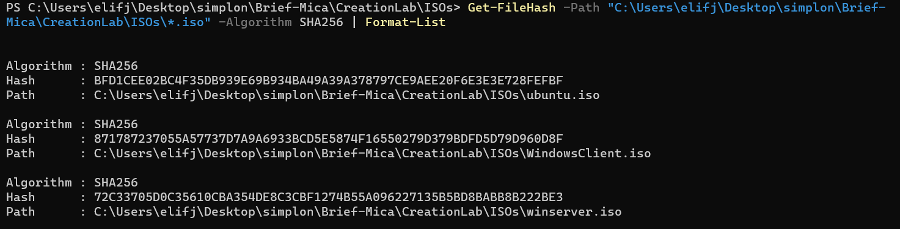

**Exemple de calcul de hash sous PowerShell :**
```powershell
Get-FileHash -Path "C:\chemin\vers\fichier.iso" -Algorithm SHA256
```
Comparer le résultat avec le hash officiel publié sur le site de l’éditeur.
#### Comparaison du hash Ubuntu :
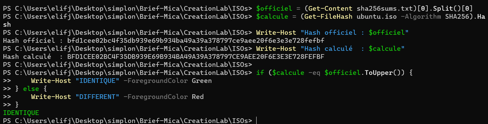
#### Fichier de hash Ubuntu officiel :
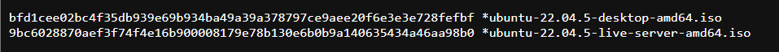
**Pourquoi ?**
- S’assurer que le fichier n’a pas été modifié (corruption, malware)
- Garantir la provenance (site officiel)

**Bonnes pratiques :**
- Toujours utiliser SHA256 (éviter MD5/SHA-1)
- Ne jamais télécharger depuis des sites tiers

### 🔐 Comprendre et Vérifier les Hashs
Un hash est une empreinte numérique unique d’un fichier. Il permet de garantir l’intégrité et l’authenticité d’un téléchargement (ex : ISO Windows/Ubuntu).

**Pourquoi vérifier ?**
- S’assurer que le fichier n’est pas corrompu ou modifié
- Détecter les malwares
- Garantir la provenance officielle

**Commande PowerShell pour SHA256 :**
```powershell
Get-FileHash -Path "C:\chemin\vers\fichier.iso" -Algorithm SHA256
```

Comparer avec le hash officiel (site éditeur ou fichier de checksums).

**Bonnes pratiques :**
- Toujours télécharger depuis le site officiel
- Vérifier le certificat HTTPS
- Ne jamais utiliser MD5/SHA-1 (obsolètes)

---


## 2. Installation et Configuration de Windows Server (AD DS)

### 2.1 Installation de Windows Server
- Créer une VM dans VirtualBox (2 vCPU, 4 Go RAM, 40 Go disque)
- Monter l’ISO et installer Windows Server
- Définir un mot de passe fort pour l’administrateur
- Mise a jour de logiciel
#### Mise à jour de Windows Server :
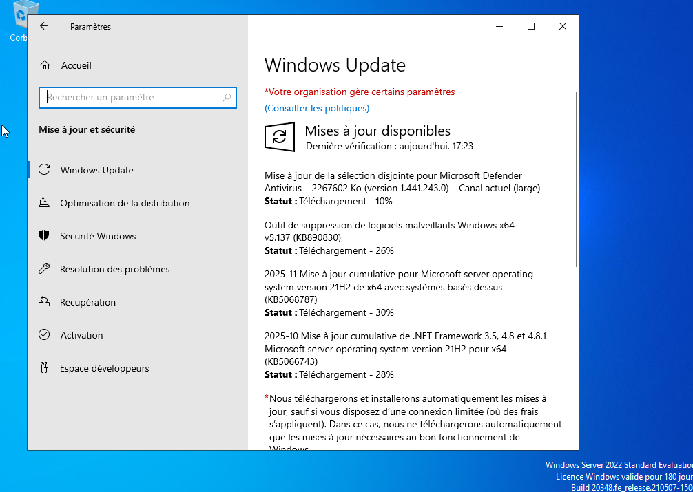
### 2.2 Configuration réseau statique
Ouvrir PowerShell en administrateur :
```powershell
New-NetIPAddress -InterfaceAlias "Ethernet" -IPAddress 192.168.100.10 -PrefixLength 24 -DefaultGateway 192.168.100.1
Set-DnsClientServerAddress -InterfaceAlias "Ethernet" -ServerAddresses 192.168.100.10
```
> L’adresse IP du DC doit être fixe et le DNS doit pointer sur lui-même.
#### Résultat de la configuration IP sur le serveur :
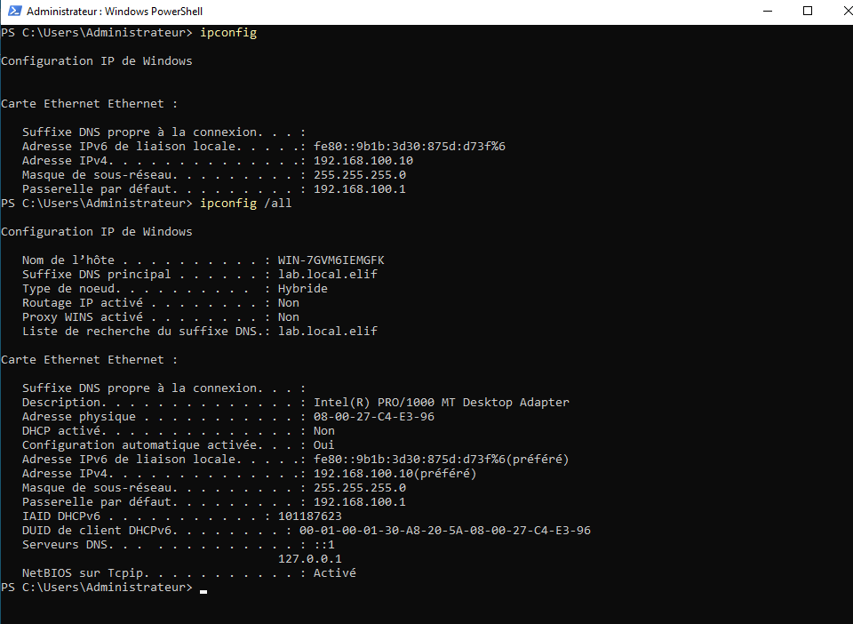
#### Détail de la configuration IP (suite) :
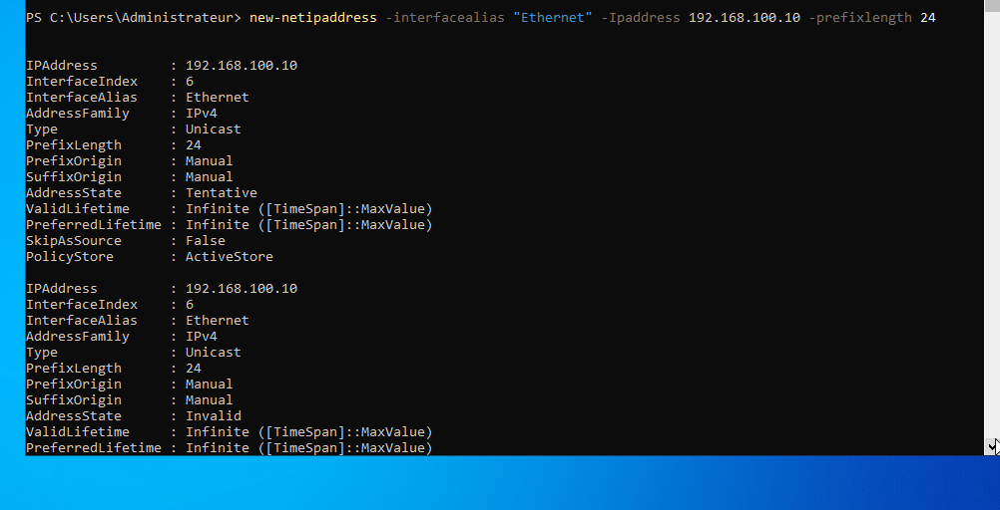
### 2.3 Installation des rôles AD DS et DNS
```powershell
Install-WindowsFeature -Name AD-Domain-Services, DNS -IncludeManagementTools
```
> Installe les services d’annuaire et DNS nécessaires à AD.

### 2.4 Promotion en Contrôleur de Domaine
```powershell
Install-ADDSForest -DomainName "lab.elif.local" -DomainNetbiosName "LAB" -SafeModeAdministratorPassword (Read-Host -AsSecureString) -InstallDNS
```
**Explications :**
- Crée la forêt, le domaine, et configure le serveur comme DC principal
- Le DNS intégré est configuré automatiquement
- Le mot de passe DSRM sert à la restauration d’urgence


### 2.5 Vérification de l’installation
Après redémarrage, ouvrir "Outils d’administration" > "Utilisateurs et ordinateurs Active Directory" pour vérifier la présence du domaine.
#### Interface AD après installation :
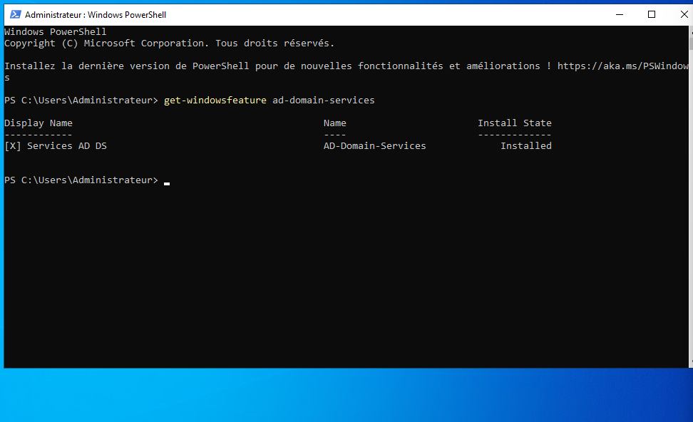

### a) Installation des rôles AD DS et DNS
```powershell
Install-WindowsFeature -Name AD-Domain-Services, DNS -IncludeManagementTools
```

### b) Promotion en Contrôleur de Domaine
```powershell
Install-ADDSForest -DomainName "lab.elif.local" -DomainNetbiosName "LAB" -SafeModeAdministratorPassword (Read-Host -AsSecureString) -InstallDNS
```

**Explications :**
- Crée la forêt AD, le domaine, et installe DNS intégré
- Le serveur devient contrôleur de domaine (DC)
- Le DNS est essentiel pour la résolution des noms AD


### 2.6 Création d’utilisateurs et groupes dans AD
Ouvrir PowerShell ou l’outil graphique :
```powershell
New-ADUser -Name "User1" -GivenName "User" -Surname "One" -SamAccountName "user1" -AccountPassword (Read-Host -AsSecureString) -Enabled $true
Add-ADGroupMember -Identity "Domain Admins" -Members "user1"
```
> On peut créer plusieurs utilisateurs pour simuler une entreprise.

---


## 3. Ajout d’un Client Windows au Domaine

### 3.1 Préparation du client
- Installer Windows 10/11 sur une nouvelle VM (2 vCPU, 2 Go RAM, 40 Go disque)
- Configurer une IP statique sur le même réseau (LabNet)
- Définir le DNS sur l’IP du DC (ex : 192.168.100.10)

### 3.2 Joindre le domaine
Panneau de configuration > Système > Modifier le nom du PC > "Domaine" : `lab.elif.local`
Saisir les identifiants d’un compte AD (ex : Administrateur du domaine)
Redémarrer la VM.


### 3.3 Vérification dans AD
Sur le DC :
```powershell
Get-ADComputer -Identity "NOM_CLIENT"
```
> Le poste apparaît dans "Ordinateurs" du domaine.
#### Exemple d’ordinateur client dans AD :


1. Configurer l’IP et le DNS du client vers le DC
2. Menu Système > Changer le nom du PC > Rejoindre un domaine : `lab.elif.local`
3. Redémarrer
4. Vérifier dans AD :
```powershell
Get-ADComputer -Identity "NOM_CLIENT"
```

---


## 4. Configuration des Services Réseau (SMB, WinRM, RDP)


### 4.1 SMB (Partage de fichiers)
Créer un dossier à partager :
```powershell
New-Item -Path "C:\PartageReadonly" -ItemType Directory
New-SmbShare -Name "Readonly" -Path "C:\PartageReadonly" -FullAccess "Tout le monde"
icacls "C:\PartageReadonly" /grant "Tout le monde:R"
```
> SMB permet le partage de fichiers entre machines du domaine.
#### Exemple d’accès au partage SMB :


### 4.2 WinRM (Administration à distance)
Activer PowerShell Remoting :
```powershell
Enable-PSRemoting -Force
```
Tester la connexion depuis le client :
```powershell
Test-WsMan 192.168.100.10
Enter-PSSession -ComputerName 192.168.100.10 -Credential LAB\Administrateur
```
#### Exemple de connexion WinRM réussie :
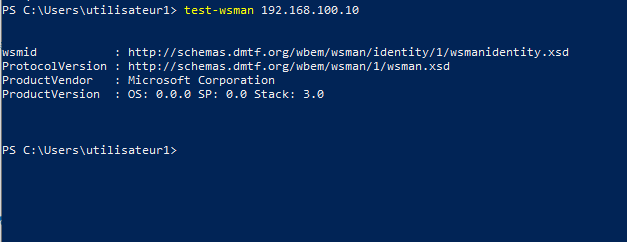


### 4.3 RDP (Bureau à distance)
Activer le Bureau à distance :
```powershell
Set-ItemProperty -Path 'HKLM:\System\CurrentControlSet\Control\Terminal Server' -Name "fDenyTSConnections" -Value 0
Enable-NetFirewallRule -DisplayGroup "Bureau à distance"
```
> Permet d’accéder au serveur via une interface graphique distante.
#### Exemple de connexion RDP :
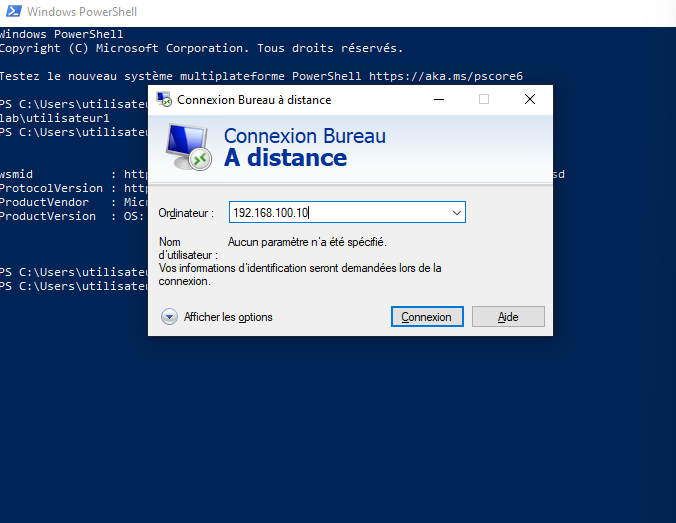

### a) SMB (Partage de fichiers)
```powershell
New-SmbShare -Name "Readonly" -Path "C:\PartageReadonly" -FullAccess "Tout le monde"
icacls "C:\PartageReadonly" /grant "Tout le monde:R"
```

### b) WinRM (Administration à distance)
```powershell
Enable-PSRemoting -Force
```

### c) RDP (Bureau à distance)
```powershell
Set-ItemProperty -Path 'HKLM:\System\CurrentControlSet\Control\Terminal Server' -Name "fDenyTSConnections" -Value 0
Enable-NetFirewallRule -DisplayGroup "Bureau à distance"
```

---


## 5. BadBlood : Remplir l’AD pour les tests

### 5.1 Présentation
BadBlood est un script qui pollue l’AD avec des milliers d’objets (utilisateurs, groupes, ordinateurs, OU) pour simuler un environnement réel.

### 5.2 Installation et exécution
- Télécharger BadBlood depuis GitHub : https://github.com/davidprowe/BadBlood
- Lancer le script PowerShell en tant qu’Administrateur du domaine


### 5.3 Vérification
```powershell
Get-ADUser -Filter * | Measure-Object
Get-ADComputer -Filter * | Measure-Object
Get-ADGroup -Filter * | Measure-Object
```
> On doit obtenir plusieurs centaines d’objets.
#### Exemple de résultat BadBlood :
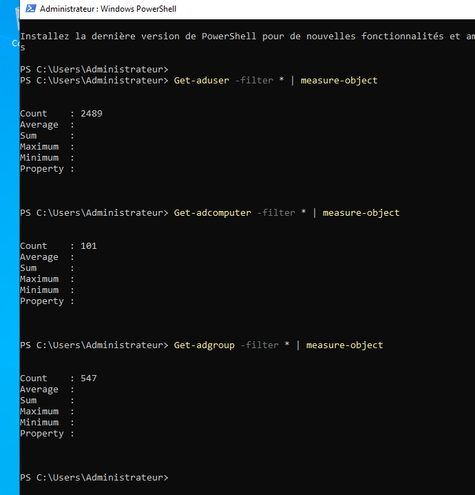

BadBlood permet de générer des milliers d’objets (utilisateurs, groupes, ordinateurs) pour simuler un vrai environnement d’entreprise.

**Vérification :**
```powershell
Get-ADUser -Filter * | Measure-Object
Get-ADComputer -Filter * | Measure-Object
Get-ADGroup -Filter * | Measure-Object
```

---


## 6. Deploiement d’un Serveur Linux (Ubuntu)

### 6.1 Installation de la VM Ubuntu
- Créer une VM Ubuntu Desktop (2 vCPU, 2 Go RAM, 30 Go disque)
- Attribuer une IP statique sur le réseau LabNet (ex : 192.168.100.20)


### 6.2 Installation et configuration SSH
```bash
sudo apt update && sudo apt install openssh-server
sudo systemctl enable --now ssh
```
> Permet l’accès distant sécurisé à la VM Linux.
#### Exemple de connexion SSH :


### 6.3 Déploiement de VulnerableLightApp
- Télécharger l’application sur GitHub
- Donner les droits d’exécution :
```bash
chmod +x VulnerableLightApp
./VulnerableLightApp
```
> Simule un serveur applicatif vulnérable pour les tests de sécurité.
#### Exemple d’application vulnérable lancée :
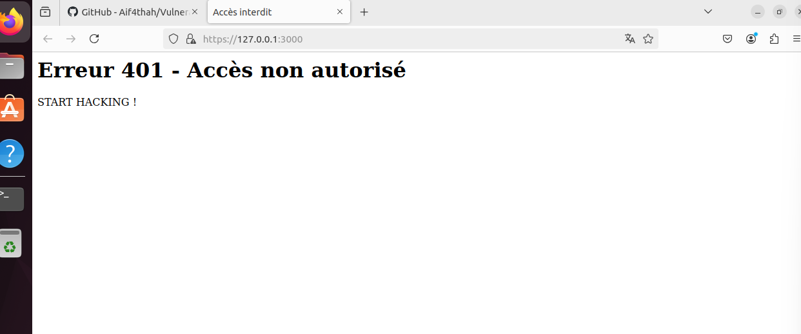

- Attribuer une IP statique sur le même réseau que les VMs Windows
- Installer SSH :
```bash
sudo apt update && sudo apt install openssh-server
```
- Déployer VulnerableLightApp (application web vulnérable)

---


## 7. Schéma d’Architecture du Lab

```
		 [Internet]
			 |
		 [NAT (optionnel)]
			 |
		 [LabNet - Réseau Interne VirtualBox]
		 /         |         \
[WinServer-DC] [WinClient] [Ubuntu]
   (AD, DNS,    (Domaine,   (SSH,
	SMB, RDP,    SMB, RDP)   VulnApp)
	WinRM)
```

**Explications :**
- Toutes les VMs sont isolées sur le réseau interne LabNet
- Le DC gère l’authentification, le DNS, les partages, etc.
- Le client Windows simule un poste utilisateur
- Le serveur Ubuntu simule un serveur applicatif vulnérable

```
		 [Internet]
			 |
		 [NAT (optionnel)]
			 |
		 [LabNet - Réseau Interne VirtualBox]
		 /         |         \
[WinServer-DC] [WinClient] [Ubuntu]
   (AD, DNS,    (Domaine,   (SSH,
	SMB, RDP,    SMB, RDP)   VulnApp)
	WinRM)
```

---


## 8. Bonnes Pratiques Sécurité

- Documenter chaque étape avec captures d’écran
- Ne jamais exposer le lab sur Internet
- Utiliser des mots de passe forts et uniques
- Isoler le réseau du lab (VirtualBox : Réseau interne)
- Garder les ISO et scripts dans un dossier sécurisé
- Appliquer les mises à jour de sécurité sur chaque VM
- Désactiver les services inutiles

- Toujours documenter les étapes et captures d’écran
- Ne jamais exposer le lab sur Internet
- Utiliser des mots de passe forts
- Isoler le réseau du lab
- Garder les ISO et scripts dans un dossier sécurisé

---


## 9. Ressources Utiles

- [PowerShell Get-FileHash](https://learn.microsoft.com/powershell/module/microsoft.powershell.utility/get-filehash)
- [SHA-256 (Wikipedia)](https://fr.wikipedia.org/wiki/SHA-2)
- [Ubuntu Verify](https://ubuntu.com/tutorials/how-to-verify-ubuntu)
- [BadBlood (GitHub)](https://github.com/davidprowe/BadBlood)

---

*Document rédigé par Elif J. — DAT Simplon 2025*

- [PowerShell Get-FileHash](https://learn.microsoft.com/powershell/module/microsoft.powershell.utility/get-filehash)
- [SHA-256 (Wikipedia)](https://fr.wikipedia.org/wiki/SHA-2)
- [Ubuntu Verify](https://ubuntu.com/tutorials/how-to-verify-ubuntu)

---

*Document rédigé par Elif J. — DAT Simplon 2025*
